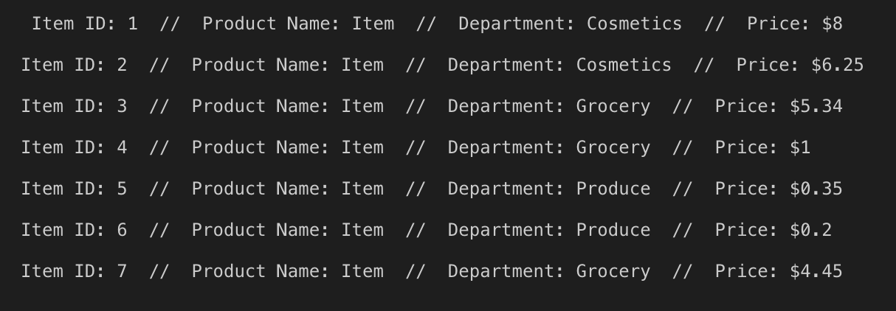
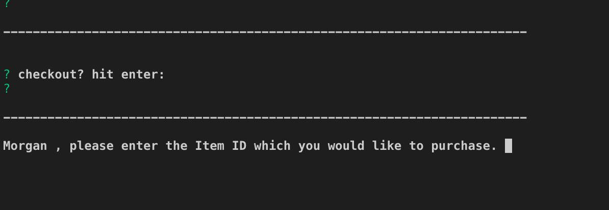
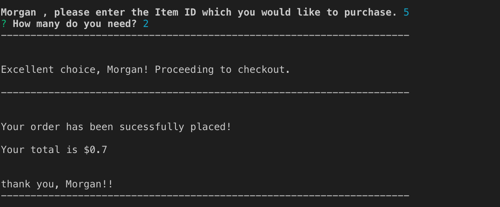
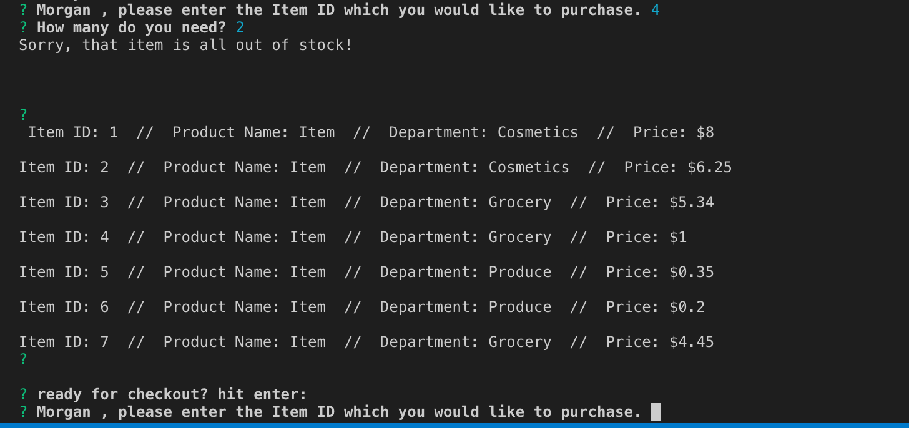

# BAMAZON

Bamazon is a small scale sales app. 
Using node, mysql and inquirer.js, we can create, delete, update and edit a stores inventory, 
watch its stock, sell, troubleshoot, retain info and keep up with supply and demand all in one interface.

Upon opening Bamazon, the app will ask your name for a more user friendly, personal shopping experience. 

From there, the user can browse the inventory

select a product 

specify their needs and be on their merry way.

Users are also given an opportunity to rechoose, if their item is out of stock. 

